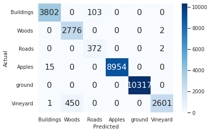
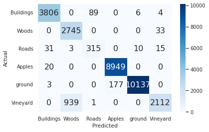
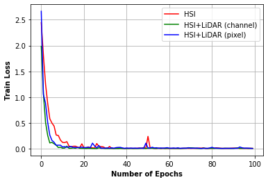

# Transformers-Models-for-Multimodal-Remote-Sensing-Data

For any queries, please contact at srinadhml99@gmail.com

# Details
In this work, I studied the performance of a new Multimodal Fusion Transformer (MFT) for Remote Sensing (RS) Image Classification proposed recently. The link for the original MFT paper is here https://arxiv.org/pdf/2203.16952.pdf. 

Transformer-based models are widely used in several image-processing applications due to their promising performance over Convolutional Neural Networks (CNNs). However, there are certain challenges while adapting transformer models for the Hyperspectral Image (HSI) classification tasks. In RS image classification, using images from multiple sources and exploiting the complementary information is getting more attention these days with the increased availability of multi-sensor data. But considering the patch-level processing in the transformer models and the number of spectral bands in the HSI data or the fused data (HSI+other modalities), the number of model parameters is becoming a major issue. In the MFT work, a new transformer-based architecture with novel attention and tokenization mechanisms are proposed to obtain the complementary information from other modalities through external CLS token. They showed CLS token extracted from other multimodal data is generalizing well compared to the random CLS token used in general transformer models.

In this work, I specifically studied the performance of the MFT model with vaying the CLS token. Specifically, I used the CLS token to be 'random', processed through 'channel' and 'pixel' tokenization methods. I considered the 'Trneto' dataset to validate the performance of the MFT model.
The performance is studies using Overall Accuracy (OA), Average Accuracy (AA) and KAPPA Scores. The training loss and confusion matrix are also studied. 

# Code updates
I have made some changes to the original codes.

1. Two transformer models named 'MFT' and 'Transformer' are written so that we can train or test the model performance with (HSI + other multimodal data) and without (HSI only) multimodal data respectively.
2. Transformer parameters such as 'number of HSI tokens', 'heads', 'depth', 'mlp_dimension' are made easy to tune.
3. I have updated the codes also with the 'token_type' to call as either 'channel' or 'pixel' instaed of writing two separate codes like in the original work.

# Results
Using Trento data
CLS Token | Overall Accuracy (OA) | Average Accuracy (AA) | KAPPA Score | Number of Parameters
--- | --- | --- | --- | ---
Random (HSI) | 95.45 | 92.85 | 93.91 | 262758
Channel (HSI+LiDAR) | 98.05 | 96.96 | 97.38 | 263526
Pixel (HSI+LiDAR) | 95.47 | 91.28 | 93.93 | 263526

#### The confusion matrix for CLS random, channel, pixel tokenizations and the train loss plots are here, respectively (from top to bottom).

# Observations
The MFT model is studied with only HSI images and with both HSI and LiDAR images for the land-cover classification task using Trento data. The performance metrics are clearly indicating that the MFT model with 'channel' tokenization is performing better than the 'random' CLS and 'pixel' tokenized CLS. Moreover the gain in performance is with a few number of additional trainable parameters.

# Our Next Contributions
Even the MFT model is doing better interms of fusing multimodal data and obtaining the complimentary information, there are several limitations with respect to speed etc.

We will update soon .....

# Acknowledgment
We considered part of our codes from the following source.
1. https://github.com/AnkurDeria/MFT
